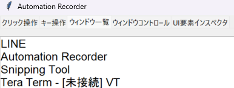
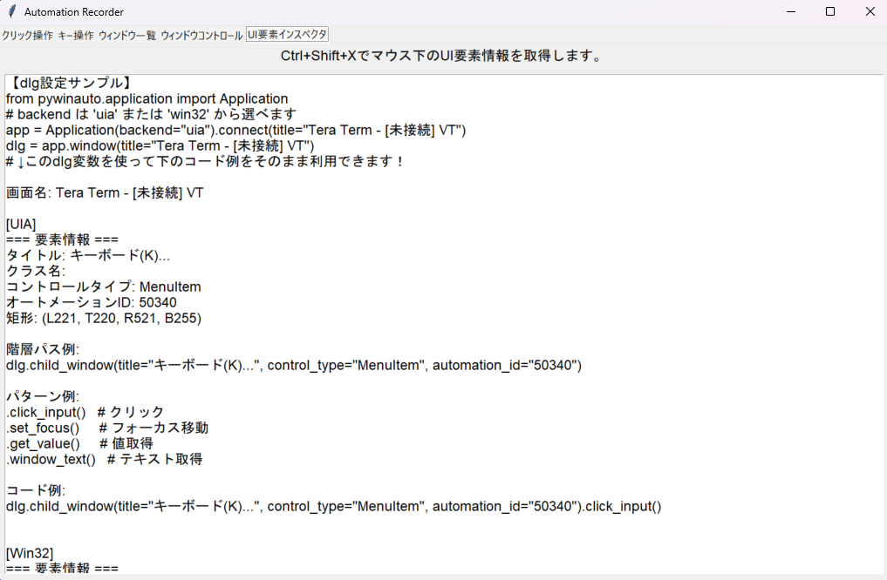

# AutomationRecorder

## 概要
`AutomationRecorder`は、`Python`を使用して`Windows`でマウスやキーボードの操作を自動化する`RPA`アプリケーションを`pyautogui`や`pywinauto`を使って、制作する人向けのアプリケーションです。<br>
このアプリケーションは、クリック位置を記録し、特定の操作を実行するためのコードを生成するなどのGUIを提供します。

## 機能

- **クリック操作記録**: ウィンドウ外でのマウスクリック位置を記録し、対応する`pyautogui`のコードを生成します。
- **キー操作記録**: キー入力やホットキーの操作を記録し、対応する`pyautogui`のコードを生成します。
- **ウィンドウ一覧取得**: デスクトップ上のすべてのウィンドウのタイトルを取得し表示します。
- **ウィンドウコントロール取得**: 選択したウィンドウのコントロール識別子を取得し表示します。表示されたコントロール識別子はテキストファイルとして保存できます。
- **UI要素インスペクタ**:  
        `UI要素インスペクタ`タブでは、`Ctrl+Shift+X`を押しながらマウスカーソル下のUI要素情報を取得し、  
        タイトル、コントロールタイプ、Automation ID、矩形、コード例などの詳細を画面上に表示します。

## ディレクトリ構成
```
AutomationRecorder
├── config
├── logs
│ └── app.log
├── src
│ └── gui
│   ├── init.py
│   └── automation_recorder.py
├── LICENCE.md
├── main.py
├── README.md
├── requirements.txt
└── start.bat
```

## セットアップ
### 前提条件
- Python 3.12
- 仮想環境 (推奨)

### インストール手順
1. リポジトリをクローンします。
    ```bash
    git clone https://github.com/stemtazoo/AutomationRecorder.git
    cd AutomationRecorderForRPA
    ```

2. 仮想環境を作成して有効化します。
    ```bash
    python -m venv venv
    source venv/bin/activate  # Windowsの場合は `venv\Scripts\activate`
    ```

3. 必要なパッケージをインストールします。
    ```bash
    pip install -r requirements.txt
    ```

### 簡単セットアップ＆起動方法

1. リポジトリをクローンまたはダウンロードします。
2. `start.bat` をダブルクリックで実行してください。
    - 仮想環境がなければ自動で作成し、必要なライブラリをインストールします。
    - セットアップ後、もう一度 `start.bat` を実行するとアプリが起動します。

> ※初回実行時のみ、セットアップ完了のメッセージが表示されます。  
>  2回目以降の実行でアプリが自動起動します。

## 使用方法
### 自動で起動したい場合

1. `start.bat` をダブルクリックで実行してください。
    - 初回実行時：仮想環境の作成・必要なライブラリのインストールが自動で行われます。
    - セットアップ完了後は、画面の指示に従ってもう一度 `start.bat` を実行するとアプリが起動します。

### 手動で起動したい場合

1. 仮想環境を有効化します。
    ```bash
    .venv\Scripts\activate
    ```
2. アプリケーションを起動します。
    ```bash
    python main.py
    ```

---

2. GUIが表示されたら、以下の操作を行うことができます。

    ### クリック操作記録
    1. `クリック操作`タブを選択します。
    2. ウィンドウ外でクリックし、クリック位置を記録します。
    3. クリック方法を選択し、コード生成ボタンを押して`pyautogui`のコードを生成します。
    4. 生成されたコードは、クリップボードにコピーされていますので、そのまま貼りつけることができます。
    <br>
    

    ### キー操作記録
    1. `キー操作`タブを選択します。
       - Press Key を選択した場合は、 文字列を入力するか、キーを選択します。複数選択されている場合は、Hotkey になります。
       - Write Text を選択した場合は、文字列を入力してください。
       - Hotkey を選択した場合は、文字列を入力するか、キーを選択します。<br>文字列とキーが選択されている場合は、キー、文字列の順番になります。<br>キーは、チェックボックスの左からの順番になります。
    2. キー入力やホットキーを設定し、コード生成ボタンを押して`pyautogui`のコードを生成します。
    3. 生成されたコードは、クリップボードにコピーされていますので、そのまま貼りつけることができます。
    <br>
    

    ### ウィンドウ一覧取得
    1. `ウィンドウ一覧`タブを選択します。
    2. `ウィンドウを取得`ボタンを押して、デスクトップ上のすべてのウィンドウタイトルを取得します。
    <br>
    

    ### ウィンドウコントロール取得
    1. `ウィンドウコントロール`タブを選択します。
    2. `ウィンドウリストを更新`ボタンを押して、ウィンドウリストを更新します。
    3. ドロップダウンメニューからウィンドウを選択し、`コントロールを取得`ボタンを押してコントロール識別子を取得します。
    4. `コントロールを保存`ボタンを押して、識別子をテキストファイルに保存します。
    <br>
    

    ### UI要素インスペクタ
    1. `UI要素インスペクタ`タブを選択します。
    2. 画面上で確認したいUI要素の上にマウスカーソルを合わせた状態で、`Ctrl+Shift+X`を押します。
    3. 画面下部のテキストエリアに、その要素の詳細情報（タイトル、コントロールタイプ、Automation ID、矩形、pywinauto用コード例など）が表示されます。
    <br>
    

## ログ
アプリケーションの実行中に発生するイベントやエラーは、`logs/app.log`に記録されます。

## ライセンス
このプロジェクトはMITライセンスの下でライセンスされています。詳細については、[LICENSE](LICENSE.md)ファイルを参照してください。

## 問い合わせ
質問や問題がある場合は、[issues](https://github.com/stemtazoo/AutomationRecorder/issues)に投稿してください。

